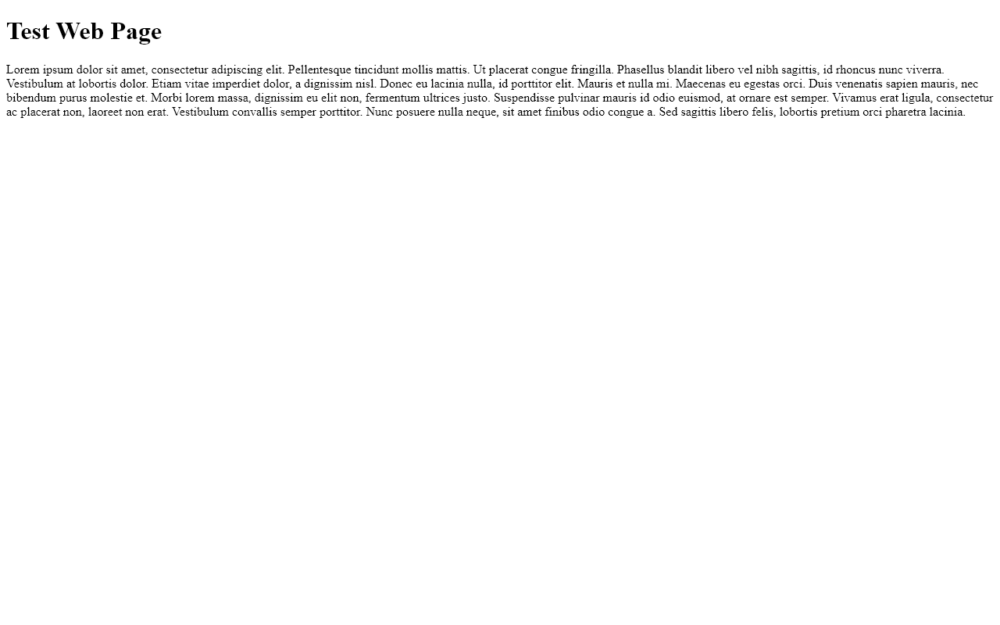

# git-timelapse 


## What's git-timelapse?

git-timelapse is an npm package that constructs timelapses of how pages in your project have evolved over time.

The following gif illustrates a very simple example and is looping although this is not the default for the package.



Currently git-timelapse only works for basic web pages or simple react apps. I intend to expand it further to offer some sort of support for more complex applications but there's some issues I'd need to address such as changes to the projects back-end or database schema.


## Usage

```sh
# install git-timelapse
npm i git-timelapse

# run it 
npx git-timelapse -g ./full/path/to/git/repo -p ./full/path/to/page 
```

## Options

- `-g /path/to/git/repo` - Full Path to folder for the git repo.
- `-p /path/to/page` - Full Path To The Page Or URL i.e https://localhost:3000


## Further Configuration

You can achieve further configuration by creating a `timelapseConfig.js` file with the following structure

```sh
module.exports = {
  #The delay between the slides in the generated gif in ms
  delay: 500,
  
  #Only include every 3rd commit in the timelapse
  skip: 3,
  
  #The name of the output file (It will still end with .git)
  outputFilename: "test",
  
  #The full hash of the earliest commit you want to include
  start: "0a79a4440e29aaa84e5cf7075a6eb1025b615261",
  
  #The full hash of the latest commit you want to include
  end: "fde000b6da818b47a6d2a8ccff0478a52a6492ab"
};
```
